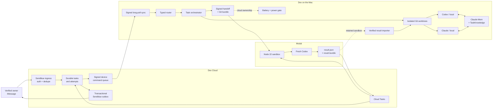

# Dex architecture

**Status:** implemented submission prototype with automated end-to-end contract coverage. Credentialed provider deployment and a real physical-sleep run remain external verification steps.

**Product boundary:** install once on a Mac, then talk to one persistent developer over iMessage.

## Design principle

Sessions are workers. Tasks are durable.

A task keeps the user's original intent, repository, branch, worktree, semantic stage, summaries, discoveries, decisions, failed approaches, tests, worker history, and cloud metadata. Claude and Codex sessions are replaceable execution attempts beneath that task identity.

## System context



Cloud messaging, verified-owner identity, durable cloud storage/scheduling, and outbound delivery are existing service boundaries. This repository owns their Dex-specific protocol adapters and the orchestration around them; it does not claim those underlying services as newly built infrastructure.

## Responsibility map

| Area | Dex repository | External boundary |
| --- | --- | --- |
| User channel | Sendblue request verification, typed payloads, signed command/receipt protocol, dedupe contracts | Sendblue line and hosted delivery |
| Identity | Pairing challenge client, device key generation, Keychain storage, request signing, pinned server-key verification | Verified owner/conversation records and server key custody |
| Task lifecycle | Typed actions, explicit state machine, task scheduler, events, worktrees, worker history, recovery | Durable cloud task rows when deployed |
| Language routing | Deterministic parser and schema-validated Gemini request policy | Gemini API |
| Local execution | Claude/Codex adapters, provider IDs, JSON event normalization, scoped environments, cancellation | Installed and authenticated provider CLIs |
| Continuity | Claude-Mem adapter, TaskKnowledge fallback, selection, redaction, checkpoint, signed handoff | Reachable Claude-Mem worker when available |
| Cloud execution | Modal mover, cloud worker, startup/result schemas, deterministic monitor, result importer | Modal control plane and private credential boundary |
| Machine control | `pmset` parsing, simulated-input disclosure, `caffeinate`, restore logic, sleep gate | macOS power subsystem |

## Submission flow

The 60-second video uses one task so the product is legible at a glance:

```text
fix checkout with codex
        │
        ▼
durable checkout task
        │
        ▼
fresh Codex / local
        │
controlled 8% battery reading
        │
        ▼
owner replies yes
        │
        ▼
checkpoint + Claude-Mem + failures + tests
        │
        ▼
fresh Codex / Modal
```

The video labels the 8% value as a controlled sensor input using the production policy path. It demonstrates the continuity concept and names Claude-Mem and Modal. It does not claim that the Mac physically slept or that a completion arrived while it remained asleep.

The fuller implemented path supports up to three concurrent workers, allowing Codex to implement while Claude investigates or reviews.

## Routing policy

The router uses the least-powerful valid interpreter:

| Class | Examples | Executor | Thinking |
| --- | --- | --- | --- |
| Exact control | status, memory, move, change agent, stop, resume, keep awake, sleep | Deterministic parser | None |
| Fast lane | Ordinary task creation and simple extraction | `gemini-3.5-flash-lite` | `minimal` |
| Brain lane | Ambiguous or context-dependent decomposition | `gemini-3.7-flash` | `low` |

Gemini returns only candidate `DexAction[]` JSON. Zod validation occurs before orchestration. Incoming message text is never executed as shell input, and no model can call `pmset` directly.

## Durable task and worker lifecycle

```text
queued
  │
  ▼
preparing ──► running ──► completed
                │  │
                │  ├──► waiting_user ──► running
                │  │
                │  └──► checkpointing ──► handoff ──► running / Modal
                │
                ├──► failed
                └──► cancelled
```

The scheduler defaults to three concurrent workers and counts active Modal workers against the limit. Each local task receives a `dex/...` branch and separate worktree. The user's original working tree is not the task workspace, and Dex does not merge, push, or deploy automatically.

Provider output is reduced to normalized events and semantic stages. The user receives concise summaries rather than JSONL or terminal logs. If the daemon restarts, active local workers are marked stopped, task identity and history are preserved, and the orchestrator can attempt bounded recovery.

Recent Claude and Codex transcripts can be discovered and normalized without attaching to arbitrary TTYs. Validated adoption-request parsing exists, but conversational adoption is not a P0 demo claim.

Cross-agent review stays on the same durable task while preserving the implementation outcome. Codex reviews run in an explicit read-only sandbox. Claude reviews combine `--safe-mode`, plan mode, explicit hook disabling, empty setting/MCP sources, disabled slash commands, no session persistence, and an editing-disabled review tool surface. Safe mode suppresses ordinary customizations while preserving persisted Claude Max authentication; repository tests inspect the constructed invocation, minimal environment, and absence of API-key variables. An authenticated provider rehearsal and organization-managed policy remain external boundaries. Full findings are retained durably, iMessage receives a bounded semantic summary, and “show me the full review” delivers the stored result in bounded ordered messages when one transport payload is insufficient.

## Memory continuity

Continuity uses two complementary stores:

1. **Claude-Mem** receives redacted normalized observations and supports progressive search/timeline retrieval.
2. **TaskKnowledge** deterministically preserves completed work, discoveries, decisions, failures, files, tests, blockers, and next steps when semantic memory is unavailable.

Dex selects a small, relevant set of observations for each new worker. Failed approaches are retained with reasons so a fresh worker can avoid repeating them.

The acceptance criterion is behavioral, not numerical: a fresh worker should use an inherited fact and avoid a known failed approach. Showing only a memory count is insufficient.

## Signed local-to-Modal handoff

Before upload, Dex checkpoints the task branch and creates:

- `repo.bundle`, containing the reconstructable task branch; and
- `handoff.json`, containing task identity, original request, completed work, decisions, failures, touched files, validation state, blockers, next step, selected memories, and bounded tracked `AGENTS.md` instructions with their repository scopes.

The package is redacted, secret-scanned, hashed, and HMAC-signed with a task-and-handoff-scoped key derived from the device root. Only that scoped key enters the sandbox; the reusable device root never does. Dex streams the scoped key over the installer process's stdin into an exclusive `0600` file, verifies the file before use, and deletes it immediately after handoff verification. Credentials are injected separately and are not stored in the handoff. All memory and repository instructions required for continuation are materialized before cloud ownership can be confirmed, so cloud Codex does not depend on the sleeping Mac or its local Claude-Mem process.

Fresh Codex starts only after the cloud worker verifies the task ID, hashes, signature, Git bundle, and required context. Startup evidence records the provider session ID, sandbox ID, handoff hash, and loaded continuity identifiers.

## Modal monitoring and result return

Monitoring is deterministic and needs no model call:

```text
sandbox ID
    │
    ▼
Cloud Tasks monitor
    │
    ├── running ──► reschedule
    │
    └── terminal
           │
           ▼
      validate result
           │
           ▼
  atomic task transition
  + exactly-once outbox
  + signed device command
```

The monitor reconnects by sandbox ID. It uses a 5-second initial delay, 10-second retries, a bounded deadline, and durable idempotency/lease keys. A success is accepted only when `result.json` matches the task and handoff identities and validation passed.

Successful cloud work creates `result.bundle`. The completed sandbox remains available for a bounded retention period. The local result importer:

1. reconnects to the expected sandbox;
2. copies the bundle into a private temporary directory;
3. verifies size, SHA-256, Git refs, task branch, and expected commit;
4. fast-forwards only a clean Dex task worktree; and
5. terminates the sandbox only after a verified import.

On a recoverable import failure, Dex records the failure without claiming local synchronization and preserves the sandbox for recovery.

## Battery and sleep safety

Both real and controlled readings call the same policy function. Real telemetry is parsed from `/usr/bin/pmset -g batt`; controlled readings carry `simulated: true` through events, prompts, `dex watch`, and user-facing text.

Low-battery prompts capture exact active local task IDs and expire. A plain `yes` in the same verified conversation moves only those captured tasks to Codex in Modal. At dispatch, Dex atomically claims the current local worker ID and lifecycle generation: either local completion wins, or the cloud handoff advances the generation and fences the late local result. It is not interpreted as arbitrary approval for another conversation or task.

Normal keep-awake uses a parent-bound `caffeinate` process. Dex does not use `sudo`, change persistent system sleep settings, or enable aggressive closed-lid behavior.

Sleep ordering is fail-closed:

1. confirm every relevant task has durable cloud ownership and monitoring;
2. send and flush truthful user-facing copy;
3. restore Dex-owned keep-awake state;
4. flush local state;
5. invoke `/usr/bin/pmset sleepnow`; and
6. report if the request fails and the Mac remains awake.

The implementation and controlled tests cover this ordering. A physical sleep and cloud completion while the host remains asleep must be proven separately in a credentialed rehearsal.

## Security boundaries

### Owner and command boundary

- Sendblue requests require the configured signing secret.
- Provider message IDs and Dex command IDs are deduplicated.
- Device requests use Ed25519 signatures, body hashes, sequence numbers, nonces, and timestamps.
- Commands require a pinned server key, verified-owner authority, matching owner/conversation identity, and valid expiry.
- Device private keys and local runtime credentials are stored in macOS Keychain.

### Repository and worker boundary

- Tasks execute only in isolated Dex worktrees.
- Processes are spawned with executable-plus-argv APIs, not shell interpolation.
- Provider environments strip unrelated Gemini, Modal, Sendblue, OpenAI, and handoff credentials.
- Workers are instructed not to push, deploy, merge, or modify protected branches.
- Exit code, provider completion, and validation evidence are checked independently.

### Memory and cloud boundary

- Known secret forms are recursively redacted and a remaining finding rejects the handoff.
- Content and artifacts are hashed; cloud handoffs require signature verification.
- Result identities must match the registered task, handoff, sandbox, branch, and commit.
- Local import never rewrites a dirty worktree or a non-Dex branch.

### Power boundary

- Power executables and arguments are fixed.
- A typed request alone is insufficient; the immediate cloud-ownership gate must pass.
- The demo control socket is schema-validated, size-bounded, owner-only, and mode `0600`.

## Verification matrix

CI runs typecheck, build, the test suite serially, production dependency audit, and whitespace validation on Node 22.

| Claim | Repository evidence | External proof still required |
| --- | --- | --- |
| Typed deterministic routing | Router schemas, route tests, composed command/runtime tests | None for local logic |
| Parallel fresh workers | Adapter and orchestrator lifecycle tests with isolated temporary repositories | Authenticated provider rehearsal for a specific deployment |
| Claude-Mem continuity | Observation/retrieval/selection tests and deterministic fallback tests | Reachable Claude-Mem service and behavioral demo evidence |
| Signed reconstructable handoff | Real temporary Git bundles, cryptographic verification, tamper rejection | Credentialed upload for a specific Modal account |
| Modal lifecycle | Mover, worker, monitor, terminal callback, and result-import tests | Live sandbox availability and credentials |
| Exactly-once completion contract | Durable monitor leases, task transition, outbox, command, and reconciliation tests | Deployed Sendblue delivery observation |
| Battery provenance | Real-parser fixtures and controlled-input policy tests | Real low-battery observation if claimed |
| Sleep safety | Deterministic gate and fake-executor ordering tests | Physical sleep followed by cloud completion if claimed |

Automated acceptance uses controlled external-provider boundaries. It is evidence for the orchestration contract, not evidence that a particular Sendblue deployment, Modal account, or physical sleep event was live.

## P1 / optional work

- bounded remediation from persisted cross-agent findings;
- durable delayed cleanup of retained Modal sandboxes; and
- optional Greptile review for an existing PR after validation passes.

Direct and ordinal-follow-up session adoption, three-task concurrency, conversation-aware task follow-ups, bounded crash/restart recovery, and read-only cross-agent review are implemented. Greptile is not required for P0 and must not block task completion. Dex never creates or pushes a PR merely to trigger review.

## Operational interfaces

| Command | Purpose | External effect |
| --- | --- | --- |
| `npm exec -- dex doctor` | Check runtime, agents, Claude-Mem, cloud config, and Modal authentication | Read-only health probes |
| `npm exec -- dex status` | Read durable local state | None |
| `npm exec -- dex watch --once` | Render the judge/developer view | None |
| `npm exec -- dex route "…"` | Inspect typed routing | May call Gemini when configured |
| `npm exec -- dex cloud doctor` | Exercise Modal create/exec/detach/reconnect/terminate | Creates and terminates a sandbox |
| `npm exec -- dex demo battery 8` | Inject an explicitly controlled reading through the daemon | Mutates Dex state and may send demo-labeled copy |
| `npm exec -- dex power restore` | Restore Dex-owned keep-awake state | Stops only Dex's power assertion |
