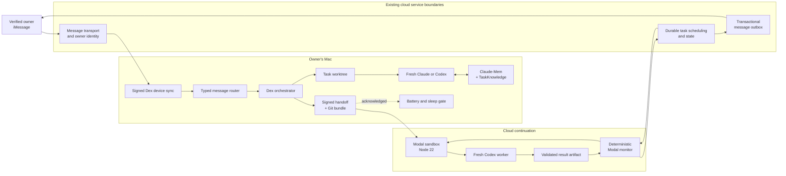

# Dex architecture

**Status:** implemented prototype with a passing composed golden-path acceptance; credentialed Sendblue/Modal/sleep rehearsal remains external

**Product boundary:** one setup command on a Mac, then an iMessage-only engineering workflow.

Dex coordinates fresh Claude and Codex workers, durable task state, memory continuity, local power behavior, and a verified handoff into Modal. It relies on existing cloud messaging and task-service boundaries for iMessage transport, owner identity, durable cloud scheduling/state, and transactional outbound delivery.

## Goals

Dex is designed to:

- turn an owner-authenticated text into one or more durable engineering tasks;
- perform exact control operations without a model;
- isolate task work in a dedicated Git worktree and branch;
- preserve useful context across fresh workers without sharing a live process;
- continue local work in a Modal sandbox before the Mac sleeps;
- monitor cloud completion deterministically and deliver one terminal message; and
- fail closed at owner, handoff, power, and result-validation boundaries.

The P0 path does not include bidirectional repository synchronization, a general agent swarm, autonomous deployment, or a review/remediation loop.

## System context



The cloud transport, task scheduler/store, and outbox are reused dependencies. Dex does not claim those service implementations as new work. Dex owns the protocol adapters and all Dex-specific orchestration shown around those boundaries.

## Runtime responsibility map

| Area | Dex repository | Existing or external boundary |
| --- | --- | --- |
| User channel | Signed device sync client, Dex message/receipt schemas, and control-plane service contracts | iMessage ingress, sender association, and outbound transport |
| Identity | Pairing challenge/service code, device key generation, Keychain storage, request signing, server-command verification | Verified owner/conversation records, deployment, and server key custody |
| Task lifecycle | Typed actions, task state machine, events, worktrees, worker supervision | Durable cloud task storage where deployed |
| Language routing | Deterministic gate and Gemini request policy | Gemini API and credential |
| Local execution | Claude/Codex CLI adapters and process lifecycle | Installed, authenticated provider CLIs |
| Continuity | Claude-Mem client, TaskKnowledge fallback, selection, redaction, Git checkpoint, signed handoff | Running Claude-Mem service when available |
| Cloud execution | Modal adapter, cloud worker, startup/result schemas | Modal control plane, sandbox runtime, and model secret |
| Completion | Deterministic monitor, control-plane completion contract, and idempotency keys | Durable scheduler transaction and outbound delivery worker |
| Machine control | `pmset` battery parsing, parent-bound `caffeinate`, sleep gate | macOS power subsystem |
| Local runtime | Long-poll bridge, router, orchestrator, memory, battery, mover, and power composition | Valid external credentials and reachable services |

## Golden-path sequence

The exact P0 conversation is:

```text
1. fix auth with codex and have claude investigate checkout failures
2. move checkout failures to the cloud and use codex,
   then sleep my mac
```

The expected sequence and gates are:

| Step | Action | Required evidence before continuing |
| --- | --- | --- |
| 1 | Existing ingress authenticates the sender and delivers a signed command to the paired device | Verified-owner authority, valid pinned-server signature, unexpired command |
| 2 | Router creates two typed task actions | Actions pass the Zod schema; no model output is executed directly |
| 3 | Task manager creates two `dex/<task-id>` branches in isolated worktrees | Durable task and event records exist |
| 4 | Fresh local Codex implements while fresh local Claude investigates | Both provider IDs are captured; progress is reduced to durable semantic events |
| 5 | Memory continuity records observations | Secrets are redacted; TaskKnowledge remains available if Claude-Mem is absent |
| 6 | Owner requests cloud continuation and sleep | Typed `MOVE_TASK` precedes typed `SLEEP` |
| 7 | Dex checkpoints local state | Task branch commit and reconstructable Git bundle are created |
| 8 | Dex creates the handoff | 5–15 selected memories, content hash, artifact hash, and HMAC signature validate |
| 9 | Dex launches Modal and uploads artifacts | Sandbox ID is known; required named secret keys are present |
| 10 | Cloud worker verifies and loads the handoff | `startup.json` matches task and handoff hash and names loaded memories/failures |
| 11 | Dex persists cloud ownership and schedules monitoring | Worker/session/sandbox IDs, hash, memory counts, and monitor request are durable |
| 12 | Dex requests sleep | The immediate deterministic confirmation gate returns true; otherwise the Mac stays awake |
| 13 | Monitor reconnects and polls | No model call; retry and terminal idempotency keys prevent duplicate effects |
| 14 | Monitor validates `result.json` | Task ID and handoff hash match; a success reports passing validation |
| 15 | Existing outbox delivers completion | Durable terminal transition and exactly one completion message |

Any failure before step 11 must keep the Mac awake. A malformed or missing result becomes a failure, never an inferred success.

## Routing policy

The router applies the least-powerful path that can interpret the message:

| Class | Examples | Executor | Thinking |
| --- | --- | --- | --- |
| Exact deterministic | status, memory query, move, change agent, stop, resume, keep awake, sleep | Typed parser and deterministic handler | None |
| Fast lane | Ordinary task creation and structured extraction | `gemini-3.5-flash-lite` | `minimal` |
| Brain lane | Long or context-dependent requests | `gemini-3.7-flash` | `low` |

The Gemini system instruction allows only Dex action types. Returned JSON is schema-validated. If the key is absent or the request fails, the router creates tasks with deterministic splitting; it does not silently turn model text into commands.

Power commands are always deterministic. A model may classify language into a typed `SLEEP` action, but only the power controller can execute `pmset sleepnow` after its confirmation gate succeeds.

Official references: [Gemini model IDs](https://ai.google.dev/gemini-api/docs/models), [Gemini thinking levels](https://ai.google.dev/gemini-api/docs/generate-content/thinking).

## Task and worker lifecycle

A task is durable independently of a worker process:

```text
queued -> preparing -> running -> completed
                         |  |
                         |  +-> waiting_user -> running
                         |
                         +-> checkpointing -> handoff -> running in Modal

Any active state may fail or be cancelled according to the state machine.
Failed and cancelled tasks may be prepared again.
```

Each task records its repository, base branch, Dex branch, worktree, worker history, semantic stage, summaries, and metadata. Workers are disposable sessions. A daemon restart marks active local worker sessions stopped while preserving task and event state.

Local Codex uses `workspace-write`, `--ask-for-approval never`, JSONL output, and `--ignore-user-config`. Unsafe bypass aliases are rejected. Local Claude defaults to `acceptEdits`; the orchestrator does not request permission bypass. Both adapters use executable-plus-argv process spawning rather than shell-interpolated commands.

## Local-to-cloud continuity

Continuity has three layers:

1. **Task state** preserves the goal, stage, branch, summaries, and worker history.
2. **TaskKnowledge and Claude-Mem** preserve learned facts, changed files, next steps, and failed approaches across fresh workers.
3. **The handoff package** makes the cloud continuation independent of the sleeping Mac.

### Memory selection

Dex prefers Claude-Mem observations and falls back to task-scoped knowledge. It selects 5–15 unique observations by task relevance, source, recency, and failure/decision value. The handoff records selected sources and warnings, so a fallback cannot be misrepresented as a Claude-Mem-backed run.

The behavioral continuity criterion is stronger than successful serialization. Demo or acceptance evidence must identify:

- the inherited fact;
- the failed approach and why it failed; and
- the cloud worker action that changed because of that context.

### Handoff contract

`handoff.json` contains:

- version, task ID, and creation time;
- goal, constraints, and acceptance criteria;
- repository location, base/head commits, working branch, and Git bundle metadata;
- 5–15 memories, memory sources/warnings, learned facts, and failed approaches;
- validation commands as argv arrays and expected evidence;
- metadata, content SHA-256, artifact hashes, and an optional integrity signature.

For Modal continuation, the signature is required and uses HMAC-SHA-256. Handoff content is redacted and scanned before writing. The handoff directory and handoff file use restricted local modes; the Git bundle is content-hashed. Both artifacts are uploaded separately from credentials and verified in the sandbox.

The cloud worker cannot call the local Claude-Mem service. It receives all required continuation context in the verified handoff.

### Current directionality

P0 supports local-to-Modal continuation. The cloud worker commits successful changes, creates `result.bundle`, hashes it, and reports the branch, commit, path, and hash in `result.json`. The completed sandbox stays reconnectable until its retention timeout. No implementation currently imports that result bundle into the local worktree, and workers are prohibited from pushing, so bidirectional local/cloud synchronization remains P1.

## Modal execution and monitoring

Dex creates a Node 22 sandbox, installs the pinned Codex CLI declared by the mover, attaches either ephemeral scoped worker values or the configured named Modal secret, and uploads:

- `repo.bundle`;
- `handoff.json`;
- the compiled cloud worker; and
- a readiness marker.

The cloud worker verifies hashes and the HMAC before cloning the bundle. It removes the HMAC and Modal credentials from the spawned Codex environment, starts fresh Codex with the inherited context, records startup evidence after receiving a provider thread ID, runs validation commands, commits successful changes, and atomically writes `result.json` plus `result.bundle`.

The monitor is deterministic:

```text
reconnect by sandbox ID
        |
      poll
   /          \
running      terminal
   |             |
reschedule   read result.json
                 |
          validate task/hash/status
                 |
        exactly-once terminal callback
```

The first retry is scheduled after 5 seconds and later retries after 10 seconds, bounded by a 25-minute deadline. On deadline, the sandbox is terminated and the task fails. `DexCloudRuntime` wires the monitor to the durable repository and Postgres-backed once/effect ledger; the standalone in-memory once implementation is retained only for focused tests.

Modal lifecycle reference: [Modal Sandboxes](https://modal.com/docs/guide/sandboxes).

## Result artifact

The terminal artifact has this shape:

```json
{
  "taskId": "checkout-failures-a1b2",
  "handoffSha256": "64-character-sha256",
  "status": "succeeded",
  "summary": "Fixed the checkout retry boundary and added coverage.",
  "validation": {
    "commands": ["[\"npm\",\"test\"]"],
    "passed": true
  },
  "git": {
    "branch": "dex/checkout-failures-a1b2",
    "commit": "commit-sha",
    "bundlePath": "/dex/result.bundle",
    "bundleSha256": "64-character-sha256"
  }
}
```

Allowed statuses are `succeeded`, `failed`, and `cancelled`. A `succeeded` artifact with failed validation is rejected. A task/hash mismatch, malformed artifact, missing artifact, nonzero sandbox exit paired with claimed success, or deadline expiry produces a terminal failure.

## Battery and sleep safety

Real battery readings come from `/usr/bin/pmset -g batt`. Simulated readings are created only through an explicit demo path and carry `simulated: true` through durable events and user-facing copy. Threshold alerts occur at 20%, 10%, and 5% while local tasks are active; charging or AC power resets the crossed-threshold list.

The demo command:

```bash
npm exec -- dex demo battery 8
```

does not query the battery. It sends the simulated reading to the running daemon through a mode-`0600` Unix control socket, records `simulated: true`, and may enqueue a notification only when the normal active-task alert conditions are met. The CLI also prints a local confirmation. It must be described as a controlled policy-path demo, not a real battery event or live iMessage test.

Dex's keep-awake assertion uses `/usr/bin/caffeinate -i -w <dex-pid>`, which prevents idle sleep only and is bound to the owning process. Dex stores the child object and captured PID and refuses to signal it if identity changes.

Sleep follows this sequence:

1. Evaluate cloud-ownership confirmation immediately before any power change.
2. If false or failed, leave the Mac untouched.
3. Restore Dex's own keep-awake assertion.
4. Run `/usr/bin/pmset sleepnow` without `sudo`.
5. If sleep fails, attempt to restore the prior keep-awake assertion.

No model call participates in the confirmation or command execution.

## Trust boundaries

### Owner and cloud command boundary

- Inbound transport webhooks require the configured shared secret, and the control-plane contract requires a verified owner/conversation association before issuing a device command.
- Non-local cloud URLs must use HTTPS.
- Device requests sign canonical metadata and content hashes with Ed25519.
- Sequence, nonce, and timestamp metadata supports replay rejection and one controlled sequence-floor recovery.
- Commands must validate against the schema, a pinned server key, verified-owner authority, the paired owner ID, and expiry/future-skew limits.
- Device private key material is stored as a generic-password item in macOS Keychain and is never interpolated into a shell command or error.

### Repository and worker boundary

- Each task operates in a dedicated worktree and Dex branch.
- Worker prompts prohibit push, deployment, merge, protected-branch modification, and destructive remote actions.
- Provider completion and exit status are checked independently; exit code zero alone is insufficient.
- Validation is explicit and recorded, but local workers can still modify files inside their authorized worktree.

### Memory and cloud boundary

- Known credential forms and sensitive keys are redacted recursively.
- A remaining secret finding rejects the handoff.
- Content and artifacts are hashed; cloud handoffs require HMAC verification.
- Signing and model keys are runtime secrets, never handoff fields.
- Result task and handoff identities must match the monitor request.

### Power boundary

- Battery and sleep commands use fixed executable paths and argv.
- Power effects require deterministic handlers and an immediate confirmation gate.
- Internal demo control enters through a schema-validated, size-bounded Unix socket with mode `0600`.
- Dex never changes persistent system sleep policy and does not use aggressive lid-sleep workarounds.

## Configuration and secrets

Local setup names are defined by [`.env.example`](../.env.example):

```text
DEX_CLOUD_URL
DEX_DEVICE_ID
DEX_DEVICE_KEY_ID
DEX_CLOUD_SERVER_KEYS_JSON
DEX_SENDBLUE_LINE
SENDBLUE_NUMBER
GEMINI_API_KEY
MODAL_TOKEN_ID
MODAL_TOKEN_SECRET
DEX_MODAL_SECRET_NAME
DEX_HANDOFF_SIGNING_KEY
DEX_HOME
CLAUDE_MEM_URL
DEX_DEFAULT_REPOSITORY
```

The setup process persists non-secret project/config values under `DEX_HOME` (default `~/.dex`) and stores the device private key plus local runtime credentials in separate macOS Keychain records. A `.env` file is not loaded automatically. The installed LaunchAgent receives `DEX_HOME` and hydrates scoped runtime credentials from Keychain.

Additional execution authority lives outside that file:

- the local Claude and Codex CLIs must already be installed and authenticated;
- Dex Cloud must provide the owner/conversation association and server verification keys;
- setup requires the Dex iMessage number plus Modal account credentials; and
- Modal must receive the cloud model credential and matching handoff verification key, either as ephemeral scoped values or through the configured named secret.

Dex Cloud accepts legacy secret-name aliases (`SENDBLUE_NUMBER`, `SENDBLUE_API_SECRET`, and `SENDBLUE_WEBHOOK_SECRET`) as well as Dex's canonical names. Values remain in the deployment secret manager; they are never copied into source or handoffs.

These values belong in the appropriate Keychain, service, or secret manager—not in Git, task state, event payloads, or handoffs.

## Verification status

As of this document update, typecheck, build, and **111 tests across 18 files** pass. Tests use controlled process spawners, mock HTTP, temporary real Git repositories, a subprocess cloud-worker harness, durable file persistence, fake Modal clients/sandboxes, and fake power executors. The composed golden-path acceptance spans signed webhook ingress through exactly-once terminal Sendblue outbox creation.

| Claim | Evidence in this repository | What remains before a live claim |
| --- | --- | --- |
| Typed deterministic routing and local transport | Router/runtime tests plus composed signed webhook → pairing → device command → daemon handling acceptance | Live Dex Cloud deployment and paired phone |
| Gemini lane/model policy | Fast/brain request-shape tests and successful real calls to both configured models | None for model availability; deployment still needs its credential |
| Claude/Codex process lifecycle | JSONL adapter tests plus successful authenticated disposable-repository smoke runs | Full run triggered by live iMessage |
| Claude-Mem request/selection behavior | Progressive retrieval tests plus real observation `#5873` written, summarized, searched, and fetched | Record the behavior in the submission video |
| Reconstructable signed handoff | Temporary real Git repo, cryptographic tests, and tamper rejection in the cloud-worker harness | Transfer one through a real Modal account |
| Modal SDK shape, mover ordering, and monitor behavior | Fake SDK/sandbox tests and startup-ack tests | Run create/upload/start/detach/reconnect/result against Modal |
| Signed messaging and control-plane contracts | Cryptographic, tamper, replay, dedupe, persistence, and composed golden-path tests | Pair with deployed Dex Cloud and exchange live iMessages |
| Real/demo battery distinction and sleep gate | Parsed `pmset` fixtures and fake executors; daemon source starts the poller | Perform an authorized real notification and sleep test |
| Exactly-once completion logic | Monitor/control-plane tests plus durable file/Postgres repository and one golden-path completion outbox | Credentialed production transaction rehearsal |

The daemon and Dex Cloud service are both runnable. The cloud service provides Postgres-backed durable state, deterministic monitor retries, Sendblue delivery/reconciliation, and HTTP control-plane routes. The automated golden path proves their contracts in-process, but the repository must not be described as having completed the physical iMessage → real Modal → sleeping Mac → completion-iMessage demonstration until credentials are configured and that rehearsal is recorded.

## P1 after the physical golden path

- automatic worker-crash replacement and complete daemon-restart recovery;
- old Claude/Codex session adoption and three-task concurrency;
- importing a verified Modal `result.bundle` into the local Dex worktree;
- cross-agent review and bounded remediation; and
- optional Greptile review after tests pass, with material findings converted to structured Dex feedback for at most one fresh Codex remediation attempt.

## Internal operational commands

These are implementation and diagnosis surfaces, not the product UI:

| Command | Purpose | External effect |
| --- | --- | --- |
| `npm exec -- dex doctor` | Check Node, macOS, Git, agent CLIs, power tools, Claude-Mem, cloud config, and Modal env | Health probes only |
| `npm exec -- dex status` | Read durable local task status | None |
| `npm exec -- dex watch --once` | Render judge/developer state view | None |
| `npm exec -- dex route "…"` | Inspect typed routing | May call Gemini when configured |
| `npm exec -- dex cloud doctor` | Exercise Modal create/exec/detach/reconnect/terminate | Creates and terminates a real sandbox |
| `npm exec -- dex demo battery 8` | Inject a clearly simulated policy reading through the daemon control socket | Mutates local Dex state and may enqueue demo-labeled copy |
| `npm exec -- dex power restore` | Attempt local power recovery | Changes only the invoking Dex process's assertion state |

## Provenance

Dex-specific work includes the device protocol adapter, typed router, task/worker state, agent adapters, memory continuity, handoff integrity, local power controls, Modal continuation, deterministic monitor, and product copy. Existing cloud messaging, identity, scheduling/storage, and outbound outbox service boundaries are reused. This architecture depends on them without claiming they were created as part of Dex.
